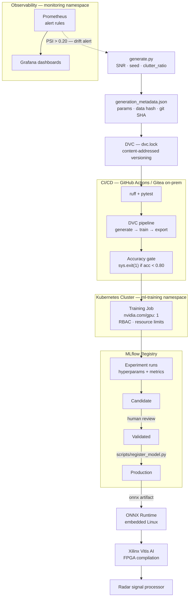

# Radar Signal Classifier — MLOps Demo

> End-to-end model factory pipeline for radar target/clutter classification,
> built to demonstrate production-grade MLOps thinking for defense and
> safety-critical environments.

[](https://weibel-mlops-demo.streamlit.app)

---

## Are you non-technical and just want to see it work?

No setup needed. Click the badge above or go to **[weibel-mlops-demo.streamlit.app](https://weibel-mlops-demo.streamlit.app)** to open the live demo in your browser.

The demo lets you:
- Generate a radar target or clutter signal at any noise level and watch the model classify it in real time
- Compare how target and clutter signals look in the time and frequency domain
- See how classification accuracy degrades as noise increases
- Walk through the full pipeline — from data generation to edge deployment — in plain language

The rest of this README is for engineers who want to understand or run the pipeline themselves.

---

## What This Project Demonstrates

- **CI/CD for ML pipelines** — GitHub Actions and self-hosted Gitea (on-prem, air-gapped)
- **Radar-oriented synthetic data generation** — reproducible, seed-controlled, DVC-versioned
- **Kubernetes training orchestration** — GPU scheduling, RBAC, namespace isolation, Helm chart
- **DVC + MLflow experiment lineage** — every model traceable to its exact data, code, and parameters
- **Model registry with promotion gates** — Candidate → Validated → Production, gated on accuracy thresholds
- **Observability stack** — Prometheus, Grafana, GPU utilization, drift metrics, alert rules
- **Drift detection** — PSI and KL divergence on live inference distributions, retraining triggers
- **ONNX export for edge deployment** — embedded Linux, Xilinx Vitis AI FPGA compilation
- **Self-hosted Gitea and air-gapped operations** — no data leaves the network
- **Infrastructure-as-Code** — Terraform for reproducible cluster provisioning

The pipeline infrastructure is the deliverable. The signal model is deliberately simple —
a production system would swap in a 2D CNN on range-Doppler maps without changing any
pipeline code.

---

## Scope and Known Limitations

This is a focused demonstrator of MLOps pipeline practice, not a production radar detector. Specifically:

- **Single-pulse, 1D signals.** A real system processes coherent bursts across multiple pulse repetition intervals, producing 2D range-Doppler maps. The pipeline is agnostic to this — only the model and data generator would change.
- **No I/Q (complex) data.** Real radar digitises in-phase and quadrature components. This demonstrator uses magnitude only, discarding phase information.
- **Balanced dataset.** Training uses a 50/50 target/clutter split. Operational radar scenes are heavily target-sparse; false alarm rate would need to be the primary design metric.
- **FPGA deployment path defined, not implemented.** The ONNX format is directly accepted by Xilinx Vitis AI for FPGA compilation. That compilation step and hardware-in-the-loop validation are outside the scope of this repo.
- **Classical baseline is MTI + peak threshold, not full CFAR.** The comparison detector applies a Moving Target Indication filter followed by a peak-to-mean ratio threshold — the standard two-stage pipeline. A production system would add OS-CFAR or GO-CFAR on top for constant false alarm rate control.

---

## Architecture



---

## Project Structure

```
weibel-mlops-demo/
├── src/
│   ├── data/generate.py           # Synthetic radar signal generator — emits data + lineage JSON
│   ├── models/classifier.py       # RadarClassifier — PyTorch MLP with baked FFT
│   ├── training/train.py          # Training loop + MLflow logging
│   └── inference/validate_onnx.py # ONNX latency and correctness validation
├── scripts/
│   ├── export_onnx.py             # ONNX export — dynamic batch axis, opset 17
│   ├── register_model.py          # MLflow registry promotion (Candidate → Production)
│   ├── drift_detect.py            # PSI + KL divergence drift detection
│   ├── benchmark_snr.py           # SNR sweep performance benchmark
│   ├── calibrate.py               # Platt scaling calibration
│   └── plot_roc.py                # ROC curve
├── k8s/
│   ├── namespaces.yaml            # ml-training, monitoring
│   ├── rbac.yaml                  # ServiceAccount + Role + RoleBinding (least-privilege)
│   ├── secrets.yaml               # Secret structure template (values injected at deploy time)
│   ├── pvc.yaml                   # NFS-backed PV + PVCs shared across namespaces
│   ├── training-job.yaml          # GPU Job: resource limits, probes, initContainer
│   └── helm/                      # Helm chart — single command deploys the full stack
│       ├── Chart.yaml
│       ├── values.yaml            # All tunable defaults, documented
│       └── templates/
├── infra/
│   ├── docker-compose.monitoring.yml  # Local: Prometheus + Grafana + MLflow
│   ├── monitoring/
│   │   ├── prometheus.yml             # Scrape config — GPU, pushgateway
│   │   └── alert_rules.yml            # Training failure, drift, GPU saturation alerts
│   └── terraform/
│       ├── main.tf                    # Namespaces, NVIDIA plugin, Prometheus stack, MLflow
│       └── variables.tf
├── .github/workflows/ml_pipeline.yml  # GitHub Actions
├── .gitea/workflows/ml_pipeline.yml   # Gitea on-prem (air-gapped)
├── dvc.yaml                           # Pipeline DAG: generate → train → export
├── params.yaml                        # Single source of truth — all hyperparameters
├── Dockerfile.train                   # Training image (PyTorch + MLflow + DVC, ~4 GB)
├── docker-compose.gitea.yml           # Self-hosted Gitea + runner
└── tests/                             # 17 unit tests — data contracts, model, ONNX
```

---

## Signal Model

The classifier distinguishes two signal types that model real radar returns:

| Class | Signal | Physical analogue |
|---|---|---|
| **Target** (label 1) | Sinusoid + AWGN | Coherent Doppler return from a moving object |
| **Clutter** (label 0) | Cumulative-sum noise (low-frequency) | Ground/sea clutter — correlated, slow-varying |

SNR is drawn uniformly from 5–20 dB per sample. The model's first operation is a Hanning
window followed by a magnitude spectrum projection: a 128-point time-domain signal is
mapped to 65 frequency bins before the MLP layers.

**Integration contract:**

| | Name | Shape | dtype |
|---|---|---|---|
| **Input** | `signal` | `[batch, 128]` | `float32` |
| **Output** | `logits` | `[batch, 2]` | `float32` |

Input is 128 raw ADC samples from a single pulse repetition interval. The FFT is baked into
the ONNX graph — the signal processor feeds samples directly with no upstream preprocessing.
Output `argmax`: 0 = clutter, 1 = target. Confidence: `softmax(logits)[predicted_class]`.

**Host CPU baseline latency:** p50 = 0.035 ms, p99 = 0.055 ms (batch_size=1).

<details>
<summary>ONNX graph structure — <code>python scripts/inspect_onnx.py</code></summary>

```
Nodes : 14    Learned params : 16,838    Total (incl. buffers): 16,966

Op types:
  Mul      : 1   ← Hanning window
  DFT      : 1   ← torch.fft.rfft (baked FFT — real ONNX DFT node)
  Gather   : 2   ← extract real and imaginary parts
  Pow      : 2   ← re², im²
  Add      : 1   ← re² + im²
  Sqrt     : 1   ← magnitude
  Unsqueeze: 1   ← shape bookkeeping
  Gemm     : 3   ← linear layers (BatchNorm folded by ONNX optimizer)
  Relu     : 2
```
</details>

---

## Run the Pipeline Locally

```bash
git clone https://github.com/Michael-Bach/weibel-mlops-demo
cd weibel-mlops-demo
python -m venv .venv && source .venv/bin/activate
pip install -r requirements.txt
export PYTHONPATH=.
```

**Step 1 — Lint and tests (~10 s, no data needed)**
```bash
python -m ruff check .
pytest tests/ -v
```

**Step 2 — Generate synthetic radar data**
```bash
python src/data/generate.py
# Writes data/raw/X.npy, data/raw/y.npy
# Writes data/processed/X_train.npy, X_val.npy, y_train.npy, y_val.npy
# Writes data/processed/generation_metadata.json  ← lineage record
```

**Step 3 — Train**
```bash
python src/training/train.py
# Logs all params + epoch metrics to MLflow
# Writes artifacts/model_best.pt + artifacts/metrics.json
# Exits with code 1 if val_accuracy < 0.80
```

**Step 4 — Export to ONNX**
```bash
python scripts/export_onnx.py
# Writes artifacts/model.onnx with dynamic batch axis
```

**Step 5 — Validate ONNX**
```bash
python src/inference/validate_onnx.py
# Runs 1000 timed inferences, prints p50/p99 latency
```

**Run the full pipeline with DVC (reproducible, cached):**
```bash
dvc repro          # runs only stages whose inputs have changed
dvc repro --force  # force full re-run
```

---

## CI/CD

The workflow runs on every push:

```
ruff lint → pytest → generate data → train → accuracy gate → export ONNX → upload artifacts
```

CI training is a fast validation pass — confirms the pipeline is not broken. Production
training runs on Kubernetes (section below), where multiple param sweeps run in parallel.

**Quality gate** in `train.py`:
```python
if best_acc < baseline_accuracy:
    sys.exit(1)  # fails the CI job; no model artifact is promoted
```

**Run locally with `act`:**
```bash
act push   # executes .github/workflows/ml_pipeline.yml in Docker
```

`.actrc` is pre-configured with a lightweight (~1 GB) runner image.

---

## Kubernetes — Training Infrastructure

The cluster uses two namespaces for isolation: training and monitoring.
The trained ONNX artifact is deployed directly to the radar signal processor hardware —
no serving pods run in the cluster.

```bash
# Bootstrap the cluster
kubectl apply -f k8s/namespaces.yaml
kubectl apply -f k8s/rbac.yaml
kubectl apply -f k8s/secrets.yaml   # fill in real values first
kubectl apply -f k8s/pvc.yaml

# Build and push training image
docker build -f Dockerfile.train -t YOUR_REGISTRY/weibel-radar-train:latest .
docker push YOUR_REGISTRY/weibel-radar-train:latest

# Launch a training Job
kubectl apply -f k8s/training-job.yaml

# Monitor
kubectl logs -n ml-training -l role=training -f
kubectl get jobs -n ml-training
```

**GPU scheduling** — the Job requests exactly one GPU:
```yaml
resources:
  requests:
    nvidia.com/gpu: "1"
  limits:
    nvidia.com/gpu: "1"
```

The `nodeSelector: node-type: gpu-training` routes to GPU nodes; the taint
`nvidia.com/gpu=:NoSchedule` prevents CPU workloads from consuming reserved GPU capacity.
Multiple Jobs running in parallel for a hyperparameter sweep each land in their own
isolated GPU context — the Kubernetes scheduler enforces the separation.

**Helm chart** — deploys the full stack in one command:
```bash
helm install weibel-radar k8s/helm/ \
  --set image.registry=YOUR_REGISTRY \
  --set mlflow.trackingUri=http://mlflow-server:5000 \
  --set storage.nfsServer=nfs-server.internal \
  --set monitoring.grafana.adminPassword=CHANGEME
```

All defaults are documented in `k8s/helm/values.yaml`. Override with `-f env/production.yaml`
for environment-specific settings.

---

## MLflow — Experiment Tracking and Model Registry

Each training run logs all hyperparameters from `params.yaml`, per-epoch `train_loss` and
`val_accuracy`, and `best_val_accuracy` as a summary metric.

```bash
mlflow ui    # → http://localhost:5000
```

**Ablation results** (3 runs, 30 epochs, SNR 5–20 dB):

| Config | Val accuracy | Train loss (ep 30) | Params |
|---|---|---|---|
| FFT on, hidden [64] | 100% | 0.0003 | 4,482 |
| FFT off, hidden [64] | 100% | 0.0058 | 8,514 |
| FFT on, hidden [128] | 100% | 0.0002 | 8,962 |

The FFT projection halves parameter count for equivalent accuracy because the
frequency-domain representation makes target vs. clutter near-linearly separable.

### Model Registry — Promotion Flow

```
Training run → Candidate (Staging) → Validated → Production
```

The registry enforces accuracy gates. A model cannot reach Production without passing the
Staging threshold. A human operator reviews the MLflow run before triggering promotion.

```bash
# Register a run as a Staging candidate (requires val_accuracy >= 0.90):
python scripts/register_model.py --run-id <mlflow-run-id>

# Promote a Staging version to Production (requires val_accuracy >= 0.95):
python scripts/register_model.py --run-id <mlflow-run-id> --promote-to production

# List current registry state:
python scripts/register_model.py --list
```

**Rollback:** `register_model.py` archives the previous Production version when promoting.
To roll back, transition the archived version back to Production via the MLflow UI or API.

**Audit trail:** MLflow persists the run ID, git commit, data hash, and all metrics for
every registered version. Any deployed model can be traced back to its exact training data,
code state, and parameter set.

---

## Observability

**Local monitoring stack:**
```bash
docker compose -f infra/docker-compose.monitoring.yml up -d
# Grafana:    http://localhost:3001  (admin/admin)
# Prometheus: http://localhost:9090
# MLflow:     http://localhost:5000
```

**Metrics collected:**

| Metric | Source | Purpose |
|---|---|---|
| `radar_training_val_accuracy` | Training Job (pushgateway) | Pipeline health, accuracy gate |
| `DCGM_FI_DEV_GPU_UTIL` | NVIDIA DCGM exporter | GPU saturation, scheduling pressure |
| `DCGM_FI_DEV_FB_USED` | NVIDIA DCGM exporter | GPU memory pressure, OOM risk |
| `radar_psi_score` | Drift detection job | Distribution shift, retraining trigger |
| `kube_job_status_failed` | kube-state-metrics | Training Job failure detection |

**Alert rules** (`infra/monitoring/alert_rules.yml`):

| Alert | Condition | Severity |
|---|---|---|
| `TrainingJobFailed` | Any ml-training Job failed | Critical |
| `TrainingJobStalled` | No active Jobs for > 25 h | Warning |
| `GPUSaturation` | GPU util > 95 % for 15 min | Warning |
| `FeatureDriftAlert` | PSI > 0.20 | Critical |

**Production deployment:** provision via Terraform (`infra/terraform/`) which installs
`kube-prometheus-stack` (Prometheus + Grafana + Alertmanager) into the monitoring namespace.

---

## Drift Detection and Retraining

A deployed radar classifier degrades as the operating environment changes — new terrain,
seasonal clutter statistics, hardware aging, or a different radar mode. Drift detection
converts this silent degradation into an observable signal.

**Operational flow:**

1. Every N hours a batch of recent ONNX serving inputs is extracted
2. `scripts/drift_detect.py` computes PSI and KL divergence against the training distribution
3. If PSI > 0.20 the alert fires and a retraining review is initiated
4. The team collects labelled samples from the new distribution, retrains, validates,
   and promotes via `scripts/register_model.py`

```bash
# Compare a live inference batch against the training reference:
python scripts/drift_detect.py \
    --reference data/processed/X_val.npy \
    --current   data/incoming/X_live.npy

# Exit codes: 0 = ok, 1 = warn (PSI 0.10–0.20), 2 = alert (PSI > 0.20)
```

**Features monitored:**
- Signal energy distribution (mean squared amplitude per sample)
- Spectral centroid (frequency-domain center of mass) — sensitive to Doppler shifts

**PSI thresholds:**

| PSI | Status | Action |
|---|---|---|
| < 0.10 | Stable | No action |
| 0.10–0.20 | Warn | Monitor; review recent conditions |
| > 0.20 | Alert | Initiate retraining review |

The `radar_psi_score` metric is exposed to Prometheus. The `FeatureDriftAlert` rule
fires immediately when the threshold is crossed — no polling interval delay.

---

## Edge Deployment

The final pipeline artifact is `artifacts/model.onnx` — a self-contained inference graph
with no PyTorch dependency. ONNX decouples training from runtime.

**Deployment targets:**

| Target | Runtime | Notes |
|---|---|---|
| Embedded Linux (radar processor) | ONNX Runtime | No framework needed; ~4 MB binary |
| NVIDIA Jetson | TensorRT | GPU-accelerated; convert `.onnx → .engine` |
| Intel silicon | OpenVINO | CPU-optimised; `.onnx → IR` |
| FPGA (Xilinx) | Vitis AI | `.onnx` is the accepted input format |

**FPGA path:** Xilinx Vitis AI accepts ONNX as input and compiles to a DPU instruction
stream for the Zynq UltraScale+ or Versal AI Core series. The quantisation step
(INT8) runs post-export against the same validation set used for training.

**Latency requirements:** the 128-sample input maps directly to one PRI buffer as it exits
the ADC. In a pulsed radar operating at 10 kHz PRF the inference budget is ~100 µs.
Host CPU baseline (p99 = 0.055 ms) sits well inside this budget. FPGA deployment targets
< 10 µs to leave margin for the signal processing chain upstream.

**Benchmarking:**
```bash
python src/inference/validate_onnx.py   # p50/p99 latency, batch_size=1
python scripts/benchmark_snr.py         # accuracy across -10–25 dB range
```

**Batch vs. real-time inference:** the dynamic batch axis (`dynamic_axes`) means the same
exported model handles single-sample real-time returns (batch_size=1) and large
batch evaluation jobs (batch_size=1024) without re-export.

---

## Air-Gapped Operations

For classified radar data, CI and training must run entirely within the network.
No data leaves, no model telemetry reaches external services.

**Self-hosted Gitea (on-prem Git + CI):**
```bash
# Start Gitea and the Actions runner:
docker compose -f docker-compose.gitea.yml up -d gitea
# Wait ~10 s, then open http://localhost:3000
# Admin panel → Settings → Actions → Enable

# Get a runner registration token from:
# http://localhost:3000/<user>/weibel-mlops-demo → Settings → Actions → Runners
GITEA_RUNNER_TOKEN=<token> docker compose -f docker-compose.gitea.yml up -d runner

# Push the repo:
git remote add gitea http://localhost:3000/<user>/weibel-mlops-demo.git
git push gitea master
```

The workflow at `.gitea/workflows/ml_pipeline.yml` is identical to the GitHub Actions
version — same steps, same accuracy gate, same ONNX artifact.

**Full offline operation checklist:**

| Component | Air-gapped approach |
|---|---|
| Git + CI | Self-hosted Gitea with local Actions runner |
| Container images | Local registry (Harbor); pre-pull all base images |
| Python packages | Offline pip mirror (devpi or Artifactory) |
| GitHub Actions (checkout, setup-python) | Mirror action repos into Gitea; update `uses:` paths |
| DVC remote | On-prem S3-compatible store (MinIO) or NFS |
| MLflow | SQLite backend + NFS artifact root — no external service |
| Model updates | Physical or encrypted transfer; signed artifacts |
| Audit trail | MLflow run records + `generation_metadata.json` — fully local |

**Model update procedure (air-gapped):**
1. Train on air-gapped cluster → ONNX artifact written to NFS
2. Validate on hardware-in-the-loop test rig
3. Operator runs `scripts/register_model.py --promote-to production`
4. Artifact transferred to edge system via classified channel
5. Lineage record (run ID + data hash + git SHA) archived in mission system

---

## Data and Model Lineage

Every dataset version carries a `generation_metadata.json` alongside the `.npy` files:

```json
{
  "timestamp": "2026-05-24T10:31:00+00:00",
  "git_sha": "a3f2c1d",
  "params": { "n_samples": 5000, "snr_range": [5.0, 20.0], "noise_seed": 42, "..." },
  "outputs": {
    "n_samples": 5000, "n_train": 4000, "n_val": 1000,
    "class_distribution": { "target": 2500, "clutter": 2500 }
  },
  "data_hash_md5": "d9e564c158ebfb372347c7d8493d6e35"
}
```

Combined with `dvc.lock` (which stores MD5 hashes of every pipeline input and output)
and the MLflow run record (which stores all hyperparameters and the git commit hash),
the full lineage chain is:

```
model.onnx
  → MLflow run ID
    → git SHA (code version)
    → params.yaml values (hyperparameters)
    → dvc.lock (data hashes)
      → generation_metadata.json (simulation parameters + seed)
```

**Reconstruction:** given a model version, any prior training run can be reproduced by
checking out the git SHA, restoring the DVC-tracked data (`dvc checkout`), and re-running
`dvc repro`. The output is bit-identical to the original because the seed, parameters,
and code are all pinned.

---

## Failure Modes and Responses

| Failure | Detection | Response |
|---|---|---|
| Training Job crashes | `TrainingJobFailed` alert (kube-state-metrics) | Check pod logs; inspect data integrity; re-queue Job |
| Accuracy gate fails | CI exits with code 1; MLflow run marked failed | Review loss curves; check data generation params |
| Corrupt dataset | DVC MD5 mismatch on `dvc pull`; data hash != metadata | Re-generate from params + seed; `dvc repro --force` |
| GPU node failure | `GPUNodeNotReady` alert; Jobs stuck in Pending | Reschedule to healthy node; `kubectl drain` + replace |
| Storage exhaustion | PVC at capacity; write errors in training logs | Expand PV; archive old run artifacts; `mlflow gc` |
| Inference accuracy degraded | `FeatureDriftAlert` (PSI > 0.20) | Initiate retraining review; collect new labelled data |
| Inference latency spike | `InferenceLatencyHigh` alert (p99 > 5 ms) | Check serving pod resources; profile ONNX session |
| Serving pod crash | `ServingPodsDown` alert; readiness probe failure | Kubernetes restarts automatically; check model file integrity |
| MLflow server unreachable | Training Job logs connection error; metrics missing | Confirm MLflow pod health; Job continues — metrics are non-critical path |

**Defense note:** the training pipeline is designed so that a failed metric logging step
(MLflow unreachable) does not abort training. The model artifact is always written first;
MLflow is a post-hoc record. A missed metric is recoverable; a lost model artifact is not.

---

## Design Decisions and Tradeoffs

**Why DVC instead of object store only?**
DVC provides content-addressed caching with pipeline stage awareness — it knows which
outputs are stale when an upstream input changes and reruns only those stages. A raw object
store with manually managed paths gives neither. DVC's `dvc.lock` is also a machine-readable
lineage record, not just a storage mechanism.

**Why MLflow instead of Kubeflow Pipelines?**
Kubeflow is powerful but operationally heavy — it requires Argo Workflows, a pipeline API
server, and significant cluster footprint. For a team of 2–5 researchers, MLflow's
experiment tracking covers 90% of the use case with a SQLite backend and a single process.
The threshold for Kubeflow is when you need automated pipeline orchestration at scale
(hundreds of runs per day), not experiment visibility.

**Why Kubernetes Jobs instead of Argo Workflows?**
Argo adds a full workflow engine with DAG dependencies, retry policies, and artifact
passing between steps. For single-stage GPU training Jobs that read from a shared PVC,
native Kubernetes Jobs are sufficient and require no additional operator. Argo would be
the right choice when the training DAG has multiple inter-dependent stages.

**Why ONNX?**
ONNX is the common exchange format accepted by every major edge runtime and FPGA toolchain.
Exporting to ONNX separates the training framework (PyTorch) from the deployment runtime
(ONNX Runtime, TensorRT, Vitis AI) — no retraining required when the deployment target changes.
For defense systems where the hardware platform may outlive the training framework by a decade,
this decoupling is operationally critical.

**Why Gitea instead of a managed Git service?**
In air-gapped defense environments there is no managed Git service. Gitea is the lowest-
footprint self-hosted option that supports Actions-compatible CI syntax, so the same
workflow YAML runs identically on GitHub (development) and Gitea (classified environment).
No CI syntax translation, no divergent pipeline definitions.

**Why self-hosted MLflow instead of a managed tracking service?**
Same reason as Gitea — classified radar data cannot leave the network, so cloud-hosted
experiment tracking is not an option. MLflow's SQLite backend requires no database server
for a single-team setup; a PostgreSQL backend is a one-line configuration change for production.

**What changes at scale?**
DVC remote moves from local cache to S3-compatible object store. MLflow backend moves from
SQLite to PostgreSQL with NFS artifact root. Training Jobs move to multi-node with
`torch.distributed`. The registry promotion workflow gets a formal approval step
(JIRA ticket or signed manifest). Alert routing moves from Alertmanager to PagerDuty/OpsGenie.

**What changes under air-gapped constraints?**
All external registries (Docker Hub, PyPI, GitHub) are mirrored locally. Actions runners
use local action mirrors. DVC remote points at MinIO on-prem. MLflow artifacts go to NFS.
No metric or model data crosses the air gap — the entire stack runs on sovereign infrastructure.

---

## What I'd Do Differently at Production Scale

**GPU training:** add `nvidia.com/gpu: 1` to `training-job.yaml` and use a CUDA base image.
The training code selects device automatically — no code changes. Already documented in
`k8s/training-job.yaml`.

**Hardware-in-the-loop validation:** before flashing to the radar signal processor, the ONNX
model should be validated against recorded real returns — not just synthetic data. Replay
captured returns through the ONNX graph and compare output distribution against known labels.
Synthetic data sets the floor; real clutter statistics set the ceiling.

**Signal model:** a production classifier on range-Doppler maps would use a 2D CNN operating
on the full velocity-range plane. The pipeline infrastructure is identical — only
`classifier.py` and `generate.py` change.

**CFAR comparison:** the baseline detector in most operational radars is CFAR (Constant
False Alarm Rate). The ML classifier's advantage is not at high SNR — both saturate there —
but in two regimes: (1) heterogeneous clutter where CFAR's noise model breaks down,
and (2) operating-point flexibility (the classifier outputs a calibrated score that can be
thresholded post-hoc to sweep the full ROC curve). The practical test before replacing CFAR
is hardware-in-the-loop validation on recorded real returns. `scripts/calibrate.py` fits
Platt scaling on the validation set; the ROC curve is in `artifacts/roc_curve.png`.

**Retraining trigger:** retraining should be triggered by data drift (PSI or KL divergence
on incoming signal statistics), not code commits. `scripts/drift_detect.py` implements the
detection; the retraining trigger is a Prometheus alert → alertmanager → pipeline kick.

---

## On-Prem CI — Gitea

See the [Air-Gapped Operations](#air-gapped-operations) section for setup instructions.
The `.gitea/workflows/ml_pipeline.yml` workflow mirrors the GitHub Actions definition exactly.

---

## Stack

| Tool | Role |
|---|---|
| PyTorch | Model training, FFT preprocessing layer |
| MLflow | Experiment tracking and model registry — fully self-hosted |
| DVC | Data and pipeline versioning — `dvc.yaml` defines the DAG |
| ONNX + onnxruntime | Framework-agnostic export — targets edge hardware and FPGA |
| Docker | Training image |
| Kubernetes | Job (training), Deployment (serving), namespace isolation |
| Helm | Full-stack chart — namespaces, RBAC, PVCs, training Job, serving |
| Terraform | IaC — cluster provisioning, NVIDIA plugin, monitoring stack |
| Prometheus + Grafana | Observability — training health, inference latency, GPU, drift |
| GitHub Actions / Gitea | CI/CD — lint, test, train, gate, export |
| ruff | Linting |
| pytest | Unit tests — data contracts, model interface, ONNX inference |
| scikit-learn | Platt scaling calibration, ROC curve |
