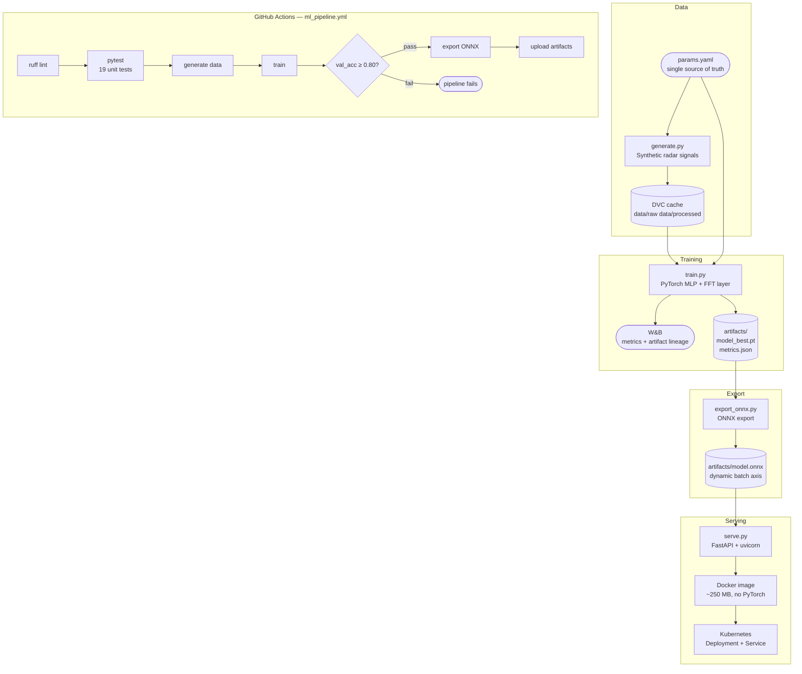

# weibel-mlops-demo

**Radar Signal Classification — End-to-End MLOps Pipeline**

A demonstration MLOps pipeline for binary radar signal classification (target vs. clutter).
The focus is infrastructure ownership: reproducible data versioning, experiment tracking,
automated quality gating, edge-ready model export, and containerised serving. The ML model
is intentionally simple — the pipeline is the point.

---

## Pipeline Architecture



---

## Repo Structure

```
weibel-mlops-demo/
├── .github/workflows/
│   └── ml_pipeline.yml      # full CI/CD pipeline
├── data/                    # DVC-tracked, git-ignored
│   ├── raw/                 # full synthetic dataset (.npy)
│   └── processed/           # train/val splits (.npy)
├── src/
│   ├── data/generate.py     # synthetic radar signal generator
│   ├── models/classifier.py # PyTorch MLP with FFT preprocessing layer
│   ├── training/train.py    # training loop + W&B logging
│   ├── inference/
│   │   └── predict_onnx.py  # ONNX inference, no PyTorch dependency
│   └── serving/
│       └── serve.py         # FastAPI endpoint wrapping OnnxPredictor
├── scripts/
│   └── export_onnx.py       # PyTorch → ONNX export
├── tests/
│   ├── test_datagen.py      # data shape/dtype/label contracts
│   ├── test_model.py        # forward pass shape + logit semantics
│   └── test_onnx.py         # ONNX load, batch/single inference, value ranges
├── k8s/
│   ├── deployment.yaml      # 2-replica Deployment with health probes
│   └── service.yaml         # ClusterIP Service routing port 80 → 8080
├── artifacts/               # model checkpoints, ONNX file, metrics.json
├── Dockerfile               # inference serving image (~250 MB)
├── params.yaml              # single source of truth for all hyperparameters
├── pyproject.toml           # ruff + pytest config
└── requirements.txt
```

---

## Quickstart

```bash
git clone https://github.com/Michael-Bach/weibel-mlops-demo
cd weibel-mlops-demo
python -m venv .venv && source .venv/bin/activate
pip install -r requirements.txt

# Lint + tests (no data or training needed)
python -m ruff check .
pytest tests/ -v

# Full pipeline (requires WANDB_API_KEY in environment)
export PYTHONPATH=.
python src/data/generate.py          # writes data/raw/ and data/processed/
python src/training/train.py         # writes artifacts/model_best.pt + metrics.json
python scripts/export_onnx.py        # writes artifacts/model.onnx
python src/inference/predict_onnx.py # runs a sample batch through the ONNX model
```

All hyperparameters are in `params.yaml`. To ablate the FFT step, set `use_fft: false` and retrain.

---

## Docker — Inference Serving

The Docker image contains only the inference and serving code — no PyTorch, no W&B, no DVC.
Training happens in CI; the image is the deployment artifact.

```bash
docker build -t weibel-radar:latest .
docker run --rm -p 8080:8080 weibel-radar:latest
```

**Endpoints:**

```bash
# Health check (used by Kubernetes liveness/readiness probes)
curl http://localhost:8080/health

# Predict — send a batch of raw time-domain signals
curl -X POST http://localhost:8080/predict \
  -H "Content-Type: application/json" \
  -d '{"signals": [[0.1, -0.3, ...128 values...]]}'

# Response
# {"predictions": [{"label": 1, "class": "target", "confidence": 0.923}]}
```

---

## Kubernetes

The `k8s/` manifests deploy the inference server to any Kubernetes cluster.

```bash
# Push image to a registry first
docker tag weibel-radar:latest YOUR_REGISTRY/weibel-radar:latest
docker push YOUR_REGISTRY/weibel-radar:latest

# Update image in k8s/deployment.yaml, then apply
kubectl apply -f k8s/
kubectl rollout status deployment/radar-inference
```

**What the manifests do:**

| Resource | Purpose |
|---|---|
| `Deployment` | Runs 2 replicas of the inference container with CPU/memory limits |
| `Service` | Load-balances across replicas; routes port 80 → container port 8080 |

The Deployment configures `readinessProbe` and `livenessProbe` on `GET /health`. Kubernetes
will not route traffic to a pod until it passes the readiness check, and will restart any pod
that fails the liveness check. A bad model image — one where the ONNX file fails to load —
never receives production traffic.

**Model update rollout:**
```bash
# After CI produces a new model artifact and builds a new image:
kubectl set image deployment/radar-inference radar-inference=YOUR_REGISTRY/weibel-radar:v2
kubectl rollout status deployment/radar-inference
# Old pods stay live until new pods pass health checks — zero downtime
```

---

## Signal Model

The classifier distinguishes two signal types, chosen as a tractable analogue to real radar returns:

| Class | Model | Physical analogue |
|---|---|---|
| **Target** (label 1) | Sinusoid at random frequency + AWGN | Coherent Doppler return from a moving target |
| **Clutter** (label 0) | Cumulative-sum noise (low-frequency dominated) | Ground/sea clutter — correlated, slow-varying |

SNR is drawn uniformly from `snr_range` (default 5–20 dB) to simulate varying detection conditions.

The model applies `torch.fft.rfft` as its first operation, projecting each 128-point time-domain
signal into 65 frequency bins before the MLP layers. Targets produce a sharp spectral peak;
clutter produces a diffuse low-frequency spectrum. These are more linearly separable in the
frequency domain, which is why the model converges in the first few epochs. The FFT is baked
into the ONNX graph — the deployed model accepts raw time-domain signals.

The 1-D signal model is an intentional simplification. A production radar classifier would operate
on 2-D range-Doppler maps, where target and clutter occupy distinct regions of the velocity-range
plane. The pipeline infrastructure is identical; only `classifier.py` and `generate.py` change.

---

## Design Decisions

**`params.yaml` as single source of truth**
Every hyperparameter — signal length, SNR range, FFT flag, hidden layer dims, learning rate,
accuracy baseline — lives in one file. All pipeline components read from it. Changing an
experiment means editing one file, not hunting through script arguments.

**FFT baked into the model graph**
`torch.fft.rfft` runs inside `RadarClassifier.forward()`, not in the data pipeline. The ONNX
export therefore takes raw time-domain signals — the deployed model is self-contained and
requires no preprocessing contract with the caller.

**`sys.exit(1)` as the CI gate**
`train.py` writes `artifacts/metrics.json` and exits non-zero if `val_accuracy < baseline_accuracy`.
This makes the quality gate intrinsic to the training step — the pipeline doesn't need a separate
evaluation script to fail the job. The CI workflow adds an explicit `evaluate` step for
log readability.

**ONNX export with dynamic batch axis**
`export_onnx.py` sets `dynamic_axes` on both input and output so the exported model accepts
any batch size. The same file handles single-sample edge requests and large batched scoring
jobs without re-export.

**Inference-only Docker image**
The Dockerfile installs only `onnxruntime`, `numpy`, `fastapi`, and `uvicorn` — no PyTorch.
The image is ~250 MB. A PyTorch image would be ~4 GB. This matters for pull times in a
Kubernetes rollout and for deployment to resource-constrained environments.

**DVC local cache only**
`data/raw/` and `data/processed/` are tracked by DVC but no remote is configured. In production
this is one line: `dvc remote add -d s3 s3://your-bucket/dvc-cache`.

**Tests run before data generation**
CI step order: lint → tests → generate → train → export. `test_onnx.py` exports its own
minimal model to a temp directory and never touches `artifacts/`. Fast feedback on interface
regressions without depending on prior pipeline state.

---

## W&B Experiment Tracking

Each training run logs:
- `train_loss` and `val_accuracy` per epoch
- Full config (data, model, training params) from `params.yaml`
- `best_val_accuracy` as a run summary metric
- `model_best.pt` as a versioned W&B Artifact

The artifact lineage view in W&B links each model version to the exact run that produced it.
Set `WANDB_API_KEY` as a GitHub Actions secret (Settings → Secrets → Actions) before pushing.

---

## What I'd Do Differently at Production Scale

**Training on Kubernetes, not CI**
The current pipeline trains in GitHub Actions because the job is fast (synthetic data, 30 epochs,
CPU). In production, training would run as a Kubernetes Job on a GPU node, triggered by data
drift or a scheduled pipeline — not a code push. CI would orchestrate: validate data, submit
the Job, wait for metrics, then build and deploy the inference image.

**Data versioning**
Replace the DVC local cache with a remote (S3/GCS). Add a data validation step so a malformed
data pull fails loudly before training.

**Model registry**
W&B Artifacts provide basic lineage. A proper registry (W&B Model Registry, MLflow, or
SageMaker Model Registry) adds promotion stages (staging → production), automated rollback
triggers, and audit trails required in a regulated environment.

**Retraining trigger**
Retraining should be triggered by data drift detection (PSI or KL divergence on incoming
signal statistics), not code commits. The model should retrain when the world changes.

**Architecture**
A production classifier on range-Doppler maps would use a 2-D CNN with domain-appropriate
augmentation — Doppler shift jitter, range gate noise, multi-path simulation. The pipeline
infrastructure is identical; only `classifier.py` and `generate.py` change.

**Observability**
The serving layer would expose a Prometheus `/metrics` endpoint (request latency, prediction
distribution, confidence histograms). Drift in the confidence distribution is an early signal
that the operating environment has shifted.

---

## Stack

| Tool | Role |
|---|---|
| PyTorch | Model definition, training, FFT layer |
| W&B | Experiment tracking and artifact lineage |
| DVC | Data versioning (local cache) |
| ONNX + onnxruntime | Framework-agnostic model export and inference |
| FastAPI + uvicorn | HTTP serving layer |
| Docker | Inference image (~250 MB, no PyTorch) |
| Kubernetes | Container orchestration — Deployment, Service, health probes |
| GitHub Actions | CI/CD — lint, test, train, gate, export |
| ruff | Linting (E, F, UP rule sets) |
| pytest | Unit tests — data contracts, model interface, ONNX inference |
