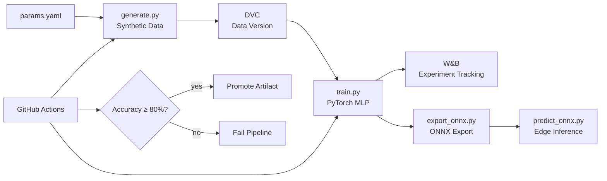

# weibel-mlops-demo

**Radar Signal Classification — End-to-End MLOps Pipeline**

A demonstration MLOps pipeline for binary radar signal classification 
(target vs. clutter), built to show full infrastructure ownership: 
synthetic data generation, experiment tracking, CI/CD gating, and 
edge-ready ONNX export.

Built as a learning artifact — see [Architecture](#architecture) for 
design decisions and [What I'd Do Differently](#production-notes) for 
production scaling notes.

## Pipeline Overview



## Quickstart

```bash
git clone https://github.com/YOUR_HANDLE/weibel-mlops-demo
cd weibel-mlops-demo
python -m venv .venv && source .venv/bin/activate
pip install -r requirements.txt

# Pull versioned data
dvc pull

# Run full pipeline
python src/data/generate.py
python src/training/train.py
python scripts/export_onnx.py
python src/inference/predict_onnx.py
```

## Architecture

[To be filled in — Component 8]

## Production Notes

[To be filled in — Component 8]