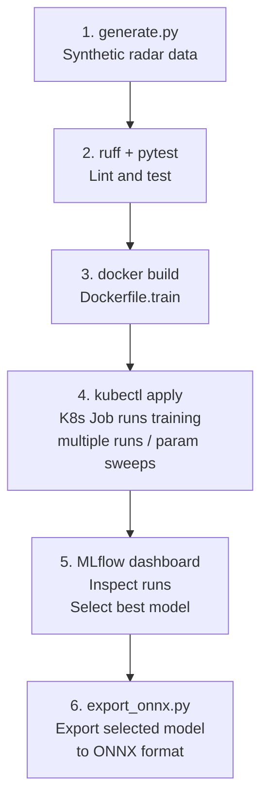

# Radar Signal Classifier — MLOps Demo

Binary classification of radar returns (target vs. clutter) built as an end-to-end MLOps
pipeline. The signal model is intentionally simple — the pipeline architecture is the point.

---

## 1. Architecture Overview



The pipeline has a deliberate human decision point at step 5. Multiple training runs land in
MLflow — different hyperparameters, different seeds — and the best model is selected before
export. ONNX export is not automatic; it is a promotion decision.

The final artifact is `model.onnx`. In production it targets the signal preprocessing hardware
inside the radar system.

---

## 2. Signal Model

The classifier distinguishes two signal types that model real radar returns:

| Class | Signal | Physical analogue |
|---|---|---|
| **Target** (label 1) | Sinusoid + AWGN | Coherent Doppler return from a moving object |
| **Clutter** (label 0) | Cumulative-sum noise (low-frequency) | Ground/sea clutter — correlated, slow-varying |

SNR is drawn uniformly from 5–20 dB per sample.

The model's first operation is `torch.fft.rfft` — a 128-point time-domain signal is projected
into 65 frequency bins before the MLP layers. Targets produce a sharp spectral peak; clutter
produces a diffuse low-frequency spectrum. These are more linearly separable in frequency
domain, which is why the model converges in the first few epochs.

The FFT is baked into the ONNX graph. The deployed model accepts raw time-domain signals
directly from the radar receiver — no separate preprocessing step, no preprocessing contract
between the model and the hardware it runs on.

---

## 3. Run the Pipeline Locally

```bash
git clone https://github.com/Michael-Bach/weibel-mlops-demo
cd weibel-mlops-demo
python -m venv .venv && source .venv/bin/activate
pip install -r requirements.txt
export PYTHONPATH=.
```

**Step 1 — Lint and tests (no data needed, ~10 seconds)**
```bash
python -m ruff check .
pytest tests/ -v
```

**Step 2 — Generate synthetic radar data**
```bash
python src/data/generate.py
# Writes data/raw/X.npy, data/raw/y.npy
# Writes data/processed/X_train.npy, X_val.npy, y_train.npy, y_val.npy
```

**Step 3 — Train the model**
```bash
python src/training/train.py
# Logs loss + val_accuracy to MLflow every epoch
# Writes artifacts/model_best.pt and artifacts/metrics.json
# Exits with code 1 if val_accuracy < 0.80
```

**Step 4 — Export to ONNX**
```bash
python scripts/export_onnx.py
# Writes artifacts/model.onnx with dynamic batch axis
```

**Step 5 — Run ONNX inference**
```bash
python src/inference/predict_onnx.py
# Loads model.onnx via onnxruntime — no PyTorch needed
# Prints label + confidence for a sample batch
```

---

## 4. CI/CD — GitHub Actions

Every push to `master` runs the full pipeline automatically:

```
ruff lint → pytest → generate data → train → evaluate → export ONNX → upload artifacts
```

CI runs training on every push as a fast validation pass — small dataset, CPU only, confirms
the pipeline is not broken. Production training runs happen on Kubernetes (section 5), where
multiple param sweeps run in parallel and land in MLflow for comparison.

The quality gate is in `train.py`:
```python
if best_acc < baseline_accuracy:
    sys.exit(1)  # fails the CI job
```

The `evaluate` step reads `artifacts/metrics.json` and prints the accuracy explicitly in the
Actions log. The ONNX file is uploaded as a build artifact — ready for hardware flashing
without re-running the pipeline.

No secrets required — MLflow writes to `./mlruns` locally. On a shared cluster, set
`MLFLOW_TRACKING_URI` to point at the on-prem MLflow server.

---

## 5. Kubernetes — Training at Scale

The training pipeline runs as a one-shot Kubernetes Job:

```bash
docker build -f Dockerfile.train -t YOUR_REGISTRY/weibel-radar-train:latest .
docker push YOUR_REGISTRY/weibel-radar-train:latest
kubectl apply -f k8s/training-job.yaml
```

`Dockerfile.train` contains the full training stack — PyTorch, MLflow, DVC (~4 GB). The Job
runs `generate → train → export` and writes `model.onnx` to a PersistentVolume. Multiple
Jobs can be kicked off with different `params.yaml` values to produce a sweep of runs in
MLflow. The Job reads `MLFLOW_TRACKING_URI` from the environment to find the on-prem server.

---

## 6. Experiment Tracking — MLflow

Each training run logs all hyperparameters from `params.yaml`, `train_loss` and
`val_accuracy` per epoch, and `best_val_accuracy` as a summary metric. The best checkpoint
is stored as a run artifact. Runs are written to `./mlruns` by default — no network, no
account, no external service.

**View the experiment dashboard:**
```bash
mlflow ui
# Open http://localhost:5000
```

Multiple runs with different hyperparameters appear side by side. The operator selects the
best run before triggering ONNX export — this is the human gate before any model touches
hardware.

To ablate the FFT step: set `use_fft: false` in `params.yaml`, retrain, and compare runs
side by side in the MLflow UI.

**On a shared cluster**, point all training Jobs at a central MLflow server:
```bash
export MLFLOW_TRACKING_URI=http://mlflow-server:5000
```
The server runs entirely on-prem — no data leaves the network.

---

## 7. Key Design Decisions

**`params.yaml` as single source of truth**
All hyperparameters live in one file. Every component reads from it. Changing an experiment
means one edit, not hunting through script arguments.

**FFT baked into the model graph**
`torch.fft.rfft` runs inside `RadarClassifier.forward()`. The ONNX export therefore accepts
raw time-domain signals — no preprocessing contract between the model and the hardware it
runs on. The signal processor feeds samples directly into the graph.

**ONNX as the deployment artifact**
ONNX decouples training from runtime. The exported `.onnx` file can be compiled for the
target hardware without retraining — ONNX Runtime for embedded Linux, TensorRT for NVIDIA
Jetson, OpenVINO for Intel silicon, or FPGA toolchains such as Xilinx Vitis AI that accept
ONNX as input. No retraining, no re-export.

**`sys.exit(1)` as the CI gate**
The quality gate is intrinsic to the training step. The pipeline can't silently promote
a bad model — it has to actively pass.

**ONNX with dynamic batch axis**
The same exported model handles single-sample real-time returns and large batched evaluation
jobs. No re-export needed when the batch size changes.

**DVC local cache only**
Data is versioned but no remote is configured. In production: one line —
`dvc remote add -d s3 s3://your-bucket/dvc-cache`.

---

## 8. What I'd Do Differently at Production Scale

**GPU training**
Add `resources.limits: nvidia.com/gpu: 1` to `training-job.yaml` and use a CUDA base image.
The training code selects the device automatically — no code changes needed.

**Retraining trigger**
Retraining should be triggered by data drift (PSI or KL divergence on incoming signal
statistics), not code commits. The model should retrain when the operating environment changes.

**Model registry**
MLflow run artifacts provide basic lineage. A proper registry adds promotion stages
(candidate → validated → released), rollback triggers, and audit trails.

**Hardware-in-the-loop testing**
Before flashing to the radar signal processor, the ONNX model should be validated against
recorded real returns — not just synthetic data. Replay captured returns through the ONNX
graph and compare the output distribution against known labels.

**Signal model**
A production classifier on range-Doppler maps would use a 2-D CNN operating on the full
velocity-range plane. The pipeline infrastructure is identical — only `classifier.py` and
`generate.py` change.

---

## 9. On-Prem CI — Gitea

For classified data, CI must run entirely within the network. Gitea is a self-hosted Git
server with built-in Actions that uses the same YAML syntax as GitHub Actions.

**Start Gitea and the runner:**
```bash
docker compose -f docker-compose.gitea.yml up -d gitea
# Wait ~10 seconds for Gitea to initialise, then open http://localhost:3000
# Create an admin account, then enable Actions:
#   Admin panel → Settings → Actions → Enable
```

**Get a runner registration token:**
```
http://localhost:3000/<your-username>/weibel-mlops-demo → Settings → Actions → Runners
```

**Start the runner with that token:**
```bash
GITEA_RUNNER_TOKEN=<token> docker compose -f docker-compose.gitea.yml up -d runner
```

**Push the repo to Gitea:**
```bash
# Create the repo in the Gitea UI first, then:
git remote add gitea http://localhost:3000/<your-username>/weibel-mlops-demo.git
git push gitea master
```

The workflow at `.gitea/workflows/ml_pipeline.yml` triggers automatically. It is identical
to the GitHub Actions workflow — same steps, same quality gate, same ONNX artifact.

**Air-gapped note:** by default the runner fetches `actions/checkout` and `actions/setup-python`
from GitHub. To go fully offline, mirror those action repos into your Gitea instance and
update the `uses:` paths to point at your local mirror.

---

## Stack

| Tool | Role |
|---|---|
| PyTorch | Model training, FFT preprocessing layer |
| MLflow | Experiment tracking and artifact lineage — fully self-hosted |
| DVC | Data versioning |
| ONNX + onnxruntime | Framework-agnostic export — targets edge hardware |
| Docker | Training image |
| Kubernetes | Job (training) |
| GitHub Actions / Gitea | CI/CD — lint, test, train, gate, export (Gitea for on-prem) |
| ruff | Linting |
| pytest | Unit tests — data contracts, model interface, ONNX inference |
