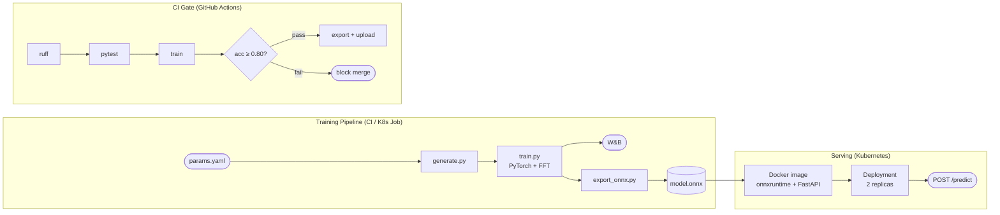

# Radar Signal Classifier — MLOps Demo

Binary classification of radar returns (target vs. clutter) built as an end-to-end MLOps
pipeline. The signal model is intentionally simple — the pipeline architecture is the point.

---

## 1. Architecture Overview



Two independent pipelines share `model.onnx` as the handoff point:

- **Training pipeline** — runs in CI (or as a Kubernetes Job). Produces and validates `model.onnx`.
- **Serving pipeline** — packages `model.onnx` into a Docker image and deploys it to Kubernetes.

You don't retrain to deploy. Training runs when the code or data changes. Deployment runs when
you want to promote a validated model. `params.yaml` is the single source of truth for both.

---

## 2. Signal Model

The classifier distinguishes two signal types that model real radar returns:

| Class | Signal | Physical analogue |
|---|---|---|
| **Target** (label 1) | Sinusoid + AWGN | Coherent Doppler return from a moving object |
| **Clutter** (label 0) | Cumulative-sum noise (low-frequency) | Ground/sea clutter — correlated, slow-varying |

SNR is drawn uniformly from 5–20 dB per sample.

The model's first operation is `torch.fft.rfft` — a 128-point time-domain signal is projected
into 65 frequency bins before the MLP layers. Targets produce a sharp spectral peak; clutter
produces a diffuse low-frequency spectrum. These are more linearly separable in frequency
domain, which is why the model converges in the first few epochs.

The FFT is baked into the ONNX graph, so the deployed model accepts raw time-domain signals
and requires no preprocessing contract with the caller.

---

## 3. Run the Pipeline Locally

```bash
git clone https://github.com/Michael-Bach/weibel-mlops-demo
cd weibel-mlops-demo
python -m venv .venv && source .venv/bin/activate
pip install -r requirements.txt
export PYTHONPATH=.
```

**Step 1 — Lint and tests (no data needed, ~10 seconds)**
```bash
python -m ruff check .
pytest tests/ -v
```

**Step 2 — Generate synthetic radar data**
```bash
python src/data/generate.py
# Writes data/raw/X.npy, data/raw/y.npy
# Writes data/processed/X_train.npy, X_val.npy, y_train.npy, y_val.npy
```

**Step 3 — Train the model**
```bash
python src/training/train.py
# Logs loss + val_accuracy to W&B every epoch
# Writes artifacts/model_best.pt and artifacts/metrics.json
# Exits with code 1 if val_accuracy < 0.80
```

**Step 4 — Export to ONNX**
```bash
python scripts/export_onnx.py
# Writes artifacts/model.onnx with dynamic batch axis
```

**Step 5 — Run ONNX inference**
```bash
python src/inference/predict_onnx.py
# Loads model.onnx via onnxruntime — no PyTorch needed
# Prints label + confidence for a sample batch
```

---

## 4. CI/CD — GitHub Actions

Every push to `master` runs the full pipeline automatically:

```
ruff lint → pytest → generate data → train → evaluate → export ONNX → upload artifacts
```

The quality gate is in `train.py`:
```python
if best_acc < baseline_accuracy:
    sys.exit(1)  # fails the CI job
```

The `evaluate` step also reads `artifacts/metrics.json` and prints the number explicitly
in the Actions log — an interviewer can read the result without understanding the training code.

Set `WANDB_API_KEY` as a GitHub Actions secret before pushing
(Settings → Secrets and variables → Actions).

---

## 5. Experiment Tracking — W&B

Each training run logs:
- `train_loss` and `val_accuracy` per epoch (with full config from `params.yaml`)
- `best_val_accuracy` as a run summary metric
- `model_best.pt` as a versioned W&B Artifact with lineage

To ablate the FFT step: set `use_fft: false` in `params.yaml`, retrain, and compare runs
side by side in W&B.

---

## 6. Docker

Two images — one for training, one for serving:

| Image | Dockerfile | Contents | Size |
|---|---|---|---|
| `weibel-radar-train` | `Dockerfile.train` | PyTorch, W&B, DVC — full pipeline | ~4 GB |
| `weibel-radar` | `Dockerfile` | onnxruntime, FastAPI, uvicorn only | ~250 MB |

**Build and run the serving image:**
```bash
docker build -t weibel-radar:latest .
docker run --rm -p 8080:8080 weibel-radar:latest
```

**Test the API:**
```bash
# Health check
curl http://localhost:8080/health
# {"status": "ok", "signal_length": 128}

# Predict
curl -X POST http://localhost:8080/predict \
  -H "Content-Type: application/json" \
  -d '{"signals": [[0.1, -0.3, 0.5, ...]]}'  # 128 floats per signal
# {"predictions": [{"label": 1, "class": "target", "confidence": 0.923}]}
```

---

## 7. Kubernetes

Three manifests cover the full pipeline on a cluster:

| Manifest | Kind | What it does |
|---|---|---|
| `k8s/training-job.yaml` | Job | Runs generate → train → export as a one-shot container |
| `k8s/deployment.yaml` | Deployment | Runs 2 replicas of the inference server |
| `k8s/service.yaml` | Service | Routes port 80 → container port 8080 across replicas |

**Run training as a Kubernetes Job:**
```bash
# Store W&B key as a K8s secret (once)
kubectl create secret generic wandb-secret --from-literal=api-key=<your-key>

# Build, push, and run
docker build -f Dockerfile.train -t YOUR_REGISTRY/weibel-radar-train:latest .
docker push YOUR_REGISTRY/weibel-radar-train:latest
kubectl apply -f k8s/training-job.yaml
kubectl wait --for=condition=complete job/radar-training
```

The training Job writes `model.onnx` to a shared PersistentVolume (`model-store-pvc`).
The serving Deployment mounts the same PVC, so no image rebuild is needed when the model updates.

**Deploy the inference server:**
```bash
docker build -t YOUR_REGISTRY/weibel-radar:latest .
docker push YOUR_REGISTRY/weibel-radar:latest
kubectl apply -f k8s/deployment.yaml -f k8s/service.yaml
kubectl rollout status deployment/radar-inference
```

The `readinessProbe` and `livenessProbe` both hit `GET /health`. A pod that fails to load
the ONNX model never passes the readiness check — bad model versions never receive traffic.

**Zero-downtime model update:**
```bash
kubectl set image deployment/radar-inference radar-inference=YOUR_REGISTRY/weibel-radar:v2
kubectl rollout status deployment/radar-inference
```

---

## 8. Key Design Decisions

**`params.yaml` as single source of truth**
All hyperparameters live in one file. Every component reads from it. Changing an experiment
means one edit, not hunting through script arguments.

**FFT baked into the model graph**
`torch.fft.rfft` runs inside `RadarClassifier.forward()`. The ONNX export therefore takes
raw time-domain signals — the deployed model is self-contained, no preprocessing required.

**`sys.exit(1)` as the CI gate**
The quality gate is intrinsic to the training step. The pipeline can't silently promote
a bad model — it has to actively pass.

**ONNX with dynamic batch axis**
The same exported model handles single-sample edge requests and large batched scoring jobs.
No re-export needed.

**Inference-only serving image**
The serving image has no PyTorch. ~250 MB vs ~4 GB. Faster Kubernetes rollouts, deployable
to resource-constrained environments.

**Shared PVC between training Job and serving Deployment**
The training Job writes `model.onnx` to a PersistentVolume. The serving pods read from it.
Model updates don't require rebuilding the serving image.

**DVC local cache only**
Data is versioned but no remote is configured. In production: one line —
`dvc remote add -d s3 s3://your-bucket/dvc-cache`.

---

## 9. What I'd Do Differently at Production Scale

**GPU training**
Add `resources.limits: nvidia.com/gpu: 1` to `training-job.yaml` and use a CUDA base image.
The training code selects the device automatically — no code changes needed.

**Retraining trigger**
Retraining should be triggered by data drift (PSI or KL divergence on incoming signal
statistics), not code commits. The model should retrain when the world changes.

**Model registry**
W&B Artifacts provide basic lineage. A proper registry (W&B Model Registry, MLflow) adds
promotion stages (staging → production), rollback triggers, and audit trails.

**Observability**
Add a Prometheus `/metrics` endpoint to the serving layer. Drift in the prediction confidence
distribution is an early signal that the operating environment has shifted.

**Architecture**
A production classifier on range-Doppler maps would use a 2-D CNN operating on the full
velocity-range plane. The pipeline infrastructure is identical — only `classifier.py` and
`generate.py` change.

---

## Stack

| Tool | Role |
|---|---|
| PyTorch | Model training, FFT preprocessing layer |
| W&B | Experiment tracking and artifact lineage |
| DVC | Data versioning |
| ONNX + onnxruntime | Framework-agnostic export and inference |
| FastAPI + uvicorn | HTTP serving layer |
| Docker | Training image and serving image |
| Kubernetes | Job (training) + Deployment + Service (serving) |
| GitHub Actions | CI/CD — lint, test, train, gate, export |
| ruff | Linting |
| pytest | Unit tests — data contracts, model interface, ONNX inference |
