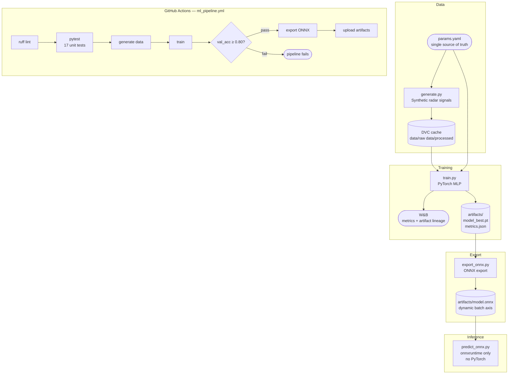

# weibel-mlops-demo

**Radar Signal Classification — End-to-End MLOps Pipeline**

A demonstration MLOps pipeline for binary radar signal classification (target vs. clutter).
The focus is infrastructure ownership: reproducible data versioning, experiment tracking,
automated quality gating, and edge-ready model export. The ML model is intentionally simple —
the pipeline is the point.

---

## Pipeline Architecture



---

## Repo Structure

```
weibel-mlops-demo/
├── .github/workflows/
│   └── ml_pipeline.yml      # full CI/CD pipeline
├── data/                    # DVC-tracked, git-ignored
│   ├── raw/                 # full synthetic dataset (.npy)
│   └── processed/           # train/val splits (.npy)
├── src/
│   ├── data/generate.py     # synthetic radar signal generator
│   ├── models/classifier.py # PyTorch MLP (RadarClassifier)
│   ├── training/train.py    # training loop + W&B logging
│   └── inference/
│       └── predict_onnx.py  # ONNX inference, no PyTorch dependency
├── scripts/
│   └── export_onnx.py       # PyTorch → ONNX export
├── tests/
│   ├── test_datagen.py      # data shape/dtype/label contracts
│   ├── test_model.py        # forward pass shape + logit semantics
│   └── test_onnx.py         # ONNX load, batch/single inference, value ranges
├── artifacts/               # model checkpoints, ONNX file, metrics.json
├── params.yaml              # single source of truth for all hyperparameters
├── pyproject.toml           # ruff (lint.select) + pytest config
└── requirements.txt
```

---

## Quickstart

```bash
git clone https://github.com/YOUR_HANDLE/weibel-mlops-demo
cd weibel-mlops-demo
python -m venv .venv && source .venv/bin/activate
pip install -r requirements.txt

# Lint + tests (no data or training needed)
ruff check .
pytest tests/ -v

# Full pipeline (requires WANDB_API_KEY in environment)
export PYTHONPATH=.
python src/data/generate.py          # writes data/raw/ and data/processed/
python src/training/train.py         # writes artifacts/model_best.pt + metrics.json
python scripts/export_onnx.py        # writes artifacts/model.onnx
python src/inference/predict_onnx.py # runs a sample batch through the ONNX model
```

All hyperparameters are in `params.yaml`. To sweep a parameter, edit that file and re-run.

---

## Signal Model

The classifier distinguishes two signal types, chosen as a tractable analogue to real radar returns:

| Class | Model | Physical analogue |
|---|---|---|
| **Target** (label 1) | Sinusoid at random frequency + AWGN | Coherent Doppler return from a moving target |
| **Clutter** (label 0) | Cumulative-sum noise (low-frequency dominated) | Ground/sea clutter — correlated, slow-varying |

SNR is drawn uniformly from `snr_range` (default 5–20 dB) to simulate varying detection conditions.

The 1-D signal model is an intentional simplification. A production radar classifier would operate
on 2-D range-Doppler maps, where target and clutter occupy distinct regions of the velocity-range
plane. Flattening to 1-D preserves the spectral distinction that makes the problem tractable while
keeping the pipeline infrastructure the focus.

---

## Design Decisions

**`params.yaml` as single source of truth**
Every hyperparameter — signal length, SNR range, hidden layer dims, learning rate, accuracy
baseline — lives in one file. The training script, data generator, model builder, and ONNX
exporter all read from it. Changing an experiment means editing one file, not hunting through
script arguments.

**`sys.exit(1)` as the CI gate**
`train.py` writes `artifacts/metrics.json` and exits non-zero if `val_accuracy < baseline_accuracy`.
This makes the quality gate intrinsic to the training step — the pipeline doesn't need a separate
evaluation script to fail the job. The CI workflow adds an explicit `evaluate` step anyway for
log readability (it prints the accuracy number in the Actions summary).

**ONNX export with dynamic batch axis**
`export_onnx.py` sets `dynamic_axes` on both input and output, so the exported model accepts
any batch size at inference time. This is the difference between a model that only works in the
exact configuration it was exported in and one that can serve single-sample edge requests or
large batched scoring jobs without re-export.

**DVC local cache only**
`data/raw/` and `data/processed/` are tracked by DVC but no remote is configured. In production
this is one line: `dvc remote add -d s3 s3://your-bucket/dvc-cache`. Keeping the demo
self-contained avoids cloud credentials while preserving the versioning pattern.

**ONNX inference with no PyTorch dependency**
`predict_onnx.py` imports only `numpy` and `onnxruntime`. This is the point of ONNX: the
inference path is decoupled from the training framework. An edge device with a 50 MB ORT
install can serve the model; it doesn't need a 2 GB PyTorch install.

**Tests run before data generation**
The CI step order is: lint → tests → generate → train → export. `test_onnx.py` exports its
own minimal model to a temp directory and never touches `artifacts/`. This means the test
suite provides fast feedback on interface regressions without depending on any prior pipeline
state.

---

## W&B Experiment Tracking

Each training run logs:
- `train_loss` and `val_accuracy` per epoch
- Full config (data, model, training params) from `params.yaml`
- `best_val_accuracy` as a run summary metric
- `model_best.pt` as a versioned W&B Artifact

The artifact lineage view in W&B links each model version to the exact run that produced it,
including the config and metrics. This is the lightweight version of an ML metadata store.

Set `WANDB_API_KEY` as a GitHub Actions secret (Settings → Secrets → Actions) before pushing.

---

## What I'd Do Differently at Production Scale

**Data versioning**
Replace the DVC local cache with a remote (S3/GCS). Add a data validation step —
[Great Expectations](https://greatexpectations.io/) or a simple schema check — so a malformed
data pull fails loudly before training rather than silently producing a bad model.

**Model registry**
W&B Artifacts provide basic lineage, but a proper registry (W&B Model Registry, MLflow, or
SageMaker Model Registry) would add promotion stages (staging → production), automated
rollback triggers, and audit trails required in a regulated environment.

**Retraining trigger**
The current pipeline runs on every push. In production, retraining would be triggered by
data drift detection (e.g. PSI or KL divergence on incoming signal statistics) rather than
code changes. The model should retrain when the world changes, not when the code does.

**Architecture**
The 1-D MLP is a proof-of-concept. A production classifier operating on range-Doppler maps
would use a 2-D CNN (or a lightweight transformer) with domain-appropriate augmentation —
Doppler shift jitter, range gate noise, multi-path simulation. The pipeline infrastructure
is identical; only `classifier.py` and `generate.py` change.

**Serving**
`predict_onnx.py` is a library function. Production serving would wrap it in a FastAPI
endpoint (or Triton Inference Server for higher throughput), add input validation, structured
logging, and a Prometheus metrics endpoint. The ONNX dynamic batch axis is already set up
for batched serving.

**Secrets management**
`WANDB_API_KEY` as a GitHub Actions secret is fine for a demo. In production: Vault or
AWS Secrets Manager, with short-lived credentials and audit logging.

---

## Stack

| Tool | Role |
|---|---|
| PyTorch | Model definition and training |
| W&B | Experiment tracking and artifact lineage |
| DVC | Data versioning (local cache) |
| ONNX + onnxruntime | Framework-agnostic model export and inference |
| GitHub Actions | CI/CD — lint, test, train, gate, export |
| ruff | Linting (E, F, I, UP rule sets) |
| pytest | Unit tests — data contracts, model interface, ONNX inference |
